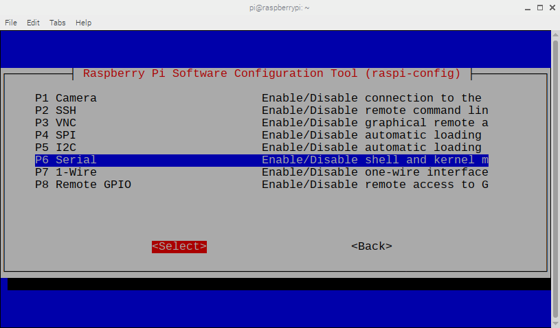
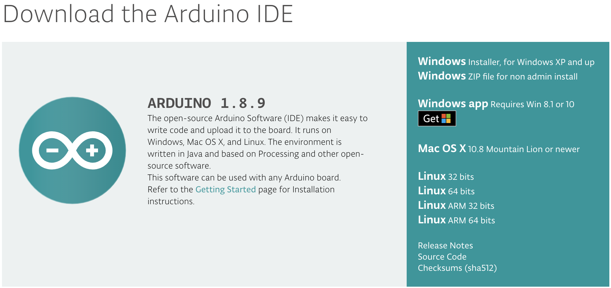
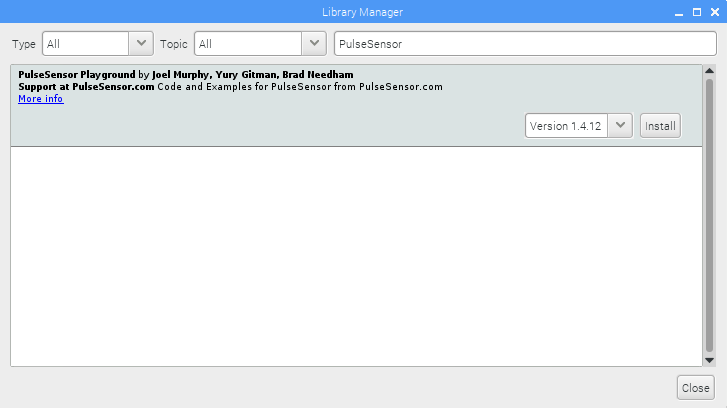

# Pulse Sensor + Arduino + Pi
Connect Pulse Sensor to Raspberry Pi with Arduino!

## Things you'll need

* Pulse Sensor
* Raspberry Pi (we use a RasPi 3 B)
* Arduino compatible microcontroller board
* USB cable

There are many was to set up your Pi. We used [Adafruit's](https://learn.adafruit.com/series/learn-raspberry-pi) tutorial to get set up. Once you have the Pi OS up and running, you will want to make sure that your configuration settings allow us to connect the Arduino. In the GUI, select `Raspberry Pi Configuration`, then open the `Interfaces` tab and enable Serial Port. This process may require you to restart your Pi.

To do this on the command line, you need to edit your config file. Open a terminal window and type in

	sudo raspi-config
	
This will open up a configuration panel. Use the arrow keys to move down to `Interfacing Options` then press the right arrow to highlight `<Select>` and press either the space bar or Enter/Return. 

In the next pane, arrow down to the Serial Port option and enable it. 

Pi may ask you to reboot, so go ahead and do that, otherwise arrow your way to `<Finish>` and get out of the config menu.

## Install Arduino IDE
Now it's time to install the Arduino IDE. Before we do that it's best to make sure that you have the latest. Open a terminal window and type in

	sudo apt-get update && sudo apt-get upgrade
	
This might take a moment. When it's done, open up a web browser on the Pi and go to 

	https://www.arduino.cc/en/Main/Software
	

Click on **Linux ARM 32 bits** to download it to your Downloads folder. Wait just a sec for it to download. Now you have a zipped up Arduino file in your Downloads folder. To unzip it, go back to the terminal window and move to the Downloads folder by entering `cd Downloads` then enter `ls` to make sure you get the right file name to extract. When I wrote this, the version was 1.8.9 your version may differ. On the command line, enter

	tar -xf arduino-1.8.9-linuxarm.tar.xz
	
to extract the folder. It will take a moment... When it's extracted move it to the `opt` directory, because that's a better place for this folder to live. Enter 

	sudo mv arduino-1.8.9 /opt

It's time to do the installation! In terminal enter 

	sudo /opt/arduino-1.8.9/install.sh

Raspberry Pi will install the Arduino IDE. Fabulous! You will find an option to run Arduino when you go to the Programming tab in the main menu of RasPi. Open Arduino, and once it is running we want to install the latest PulseSensor Playground Library. Click on 

	Sketch > Include Library > Manage Libraries
	

	
Once the Manager has settled down, type `PulseSensor` into the search field and the PulseSensor Playground Library will pop up. 

Install the latest version, and we're ready to program Arduino!

## Program Arduino
For this example, we're going to use an Arduino Uno. The playground works with just just about everything. If you're having trouble connecting Pulse Sensor with anything, please use the issues tab. Go get your Arduino and follow our [getting started guides](). 

t o    b e    c o n t i n u e d . . .
	

