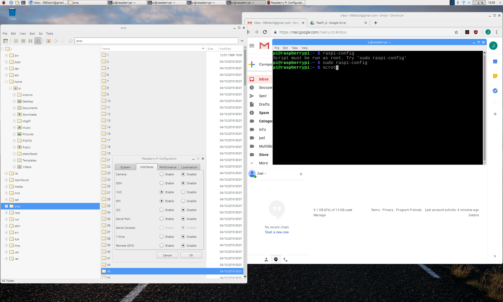
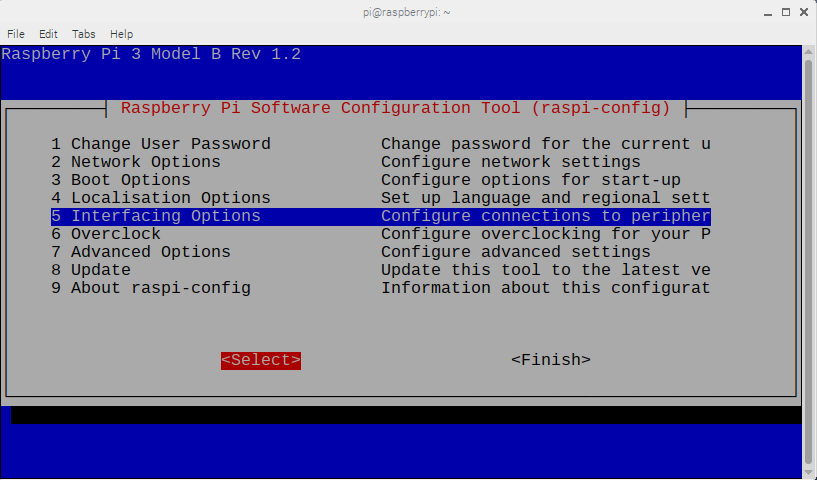
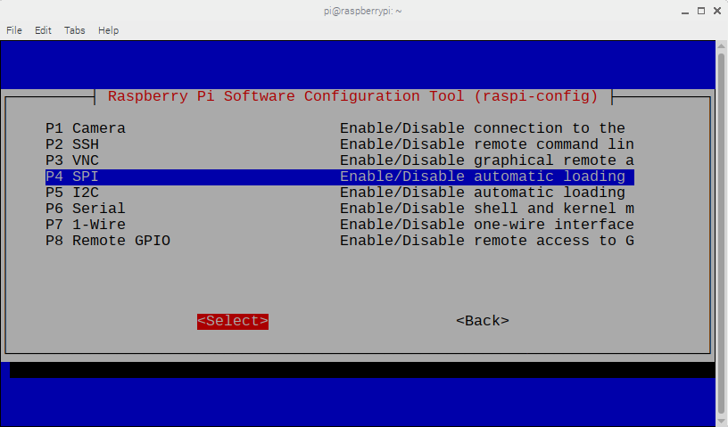
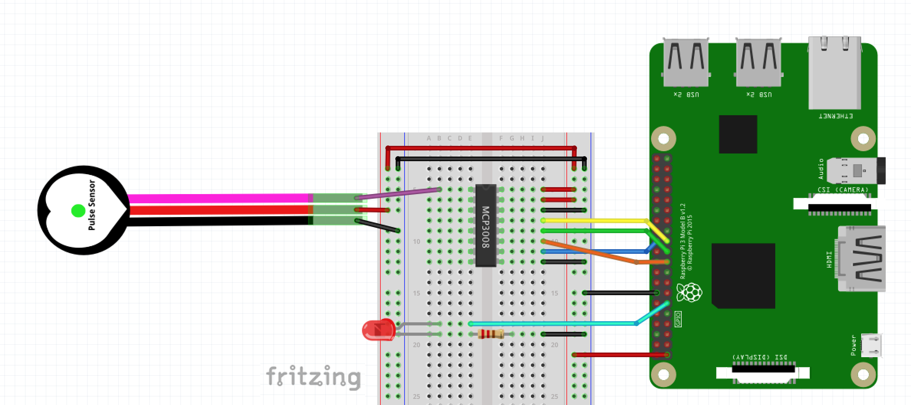
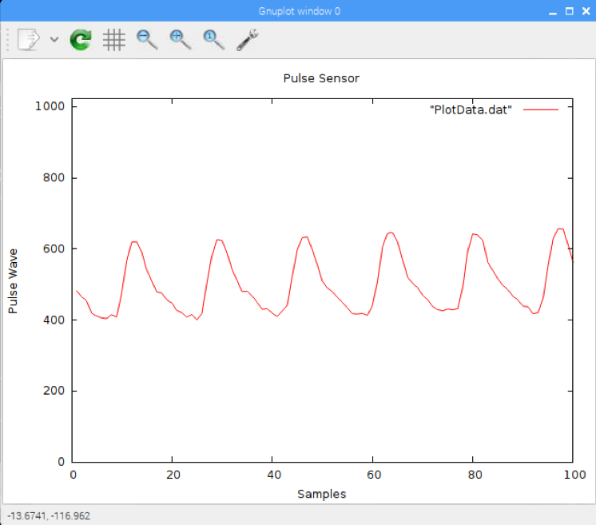

# Pulse Sensor + C + Raspberry Pi
The example code here is written in C to run on Raspberry Pi. There are two programs: **Pulse Sensor Timer** and **Pulse Sensor Gnuplot**. They both rely on the WiringPi library, which should have been included in your OS distribution. If not, go to [wiringPi](http://wiringpi.com/) to download it. You might want to update it while you're at it. Open a terminal window and type in

	`sudo get-apt update wiringPi`

## Things you'll need

* Pulse Sensor
* Raspberry Pi (we use a RasPi 3 B)
* Breadboard
* MCP3008 ADC IC
* LED & Resistor (220ohm - 1K)
* Jumper wires (male/female)

There are many was to set up your Pi. We used [Adafruit's](https://learn.adafruit.com/series/learn-raspberry-pi) tutorial to get set up. Once you have the Pi OS up and running, you will want to make sure that your configuration settings allow us to connect to the hardware SPI bus. In the GUI, select `Raspberry Pi Configuration`, then open the `Interfaces` tab and enable SPI.

To do this on the command line, you need to edit your config file. Open a terminal window and type in

	sudo raspi-config
	
This will open up a configuration panel. Use the arrow keys to move down to `Interfacing Options` then press the right arrow to highlight `<Select>` and press either the space bar or Enter/Return. 

In the next pane, arrow down to the SPI option and enable it.

Pi may ask you to reboot, so go ahead and do that, otherwise arrow your way to `<Finish>` and get out of the config menu.

## Connect your Pulse Sensor to Raspberry Pi
If this is your first time using Pulse Sensor, check out our [handy guide](https://docs.google.com/document/d/1d8EwDcXH1AZpIpEnrET28EBgStrbkbppxjQZcNRAlkI/edit?usp=sharing) for getting your Pulse Sensor set up to read beats. We also have lots of [tutorials](https://pulsesensor.com/). 

The Pulse Sensor outputs an analog signal, which the RasPi cannot natively handle. In the examples below, we are using an Analog to Digital Converter (ADC) IC to digitize the Pulse Sensor signal. As of this writing, the code below supports the MCP3008 ADC IC. (You could use the MCP3004 if you like). The Wiring Pi library has functions that enable us to easily access data from the MCP3008. You can pick one up at [Mouser](https://www.mouser.com/ProductDetail/Microchip-Technology/MCP3008-I-SL?qs=BYQkrObauiuZK6Atf%2FfReA%3D%3D&gclid=CjwKCAjwhbHlBRAMEiwAoDA343G0yGlECsWZ5zo-5UbrMk58sLaK11XtHWNU8w9fzKlpIiY343y0YBoCrBgQAvD_BwE) or [SparkFun](https://www.sparkfun.com/products/15099) or [Adafruit](https://www.adafruit.com/product/856). 

The RasPi interfaces the MCP3008 via the hardware SPI pins. Here's a diagram to help you assemble the circuit.

In addition to the MCP3008, you will need a [breadboard](https://www.adafruit.com/product/64) and some [male/female jumper cables](https://www.adafruit.com/product/826). We want to blink an LED, so you should have one of those handy, along with a resistor (220ohm to 1K should work fine).

# Pulse Sensor Timer
In order to get accurate BPM data from the Pulse Sensor, it is important to have fast and regular reading of the Pulse Sensor analog signal. By fast, we mean 500Hz (1 sample every 2 milliseconds). By regular, we mean 1 sample every 2 milliseconds. Period. Not 2.5 milliseconds, not 1.8 milliseconds, not whenever the OS decides to get around to it. This is much easier to do on a microcontroller where you are not running on top of an operating system. Arduino, for example, has no problem setting its hardware timer to sample data every 2 milliseconds on the dot. But we're not in Arduino, we're in RasPi, and things are different.

In an effort to get 'as close to the metal' as we can on the RasPi, we are using an alarm timer in this code to trigger a regular interrupt. Even though we are using a hardware clock to interrupt us, we still will get some jitter from the OS not releasing at a predictable time. 

To use this code, make a folder called `PulseSensor` and put it in your `/home/pi/Documents/` folder and place the file `PulseSensor_timer.c` in it. We're doing this because the program will store data while it's running in `/home/pi/Documents/PulseSensor`. The file is called `PULSE_DATA_<timestamp>.dat` and ends with a time stamp. 

Compile the C code by typing
	
	gcc pulseTimer PulseSensor_timer.c -lwiringPi
	
into a terminal window that is open in the PulseSensor folder. Then type

	./pulseTimer
	
to launch the program. Aside from blinking the LED to your heartbeat, this code will print data to the terminal window, and write the same data to file. The data is tab separated and arranged thusly:

 sampleCount  | Signal | BPM | IBI | Jitter
------------- | ------ | --- | --- | ------

* **sampleCount:** pretty straightforward. A counter that increases with every sample
* **Signal:** is the raw value from the ADC, which ranges from 0 - 1023
* **BPM:** Beats Per Minute. That's heart rate!
* **IBI:** Interbeat Interval. The time between beats in milliseconds
* **Jitter:** amount of time in milliseconds that our reading is off from the 2mS target

Here's a sample of what the data looks like in the terminal

### TO DO: 
Build option to read from file

We are using the `ualarm()` function call which has been deprecated. Future versions of this code will use the recommended replacement.

# Pulse Sensor gnuplot
Well, it's great and all to have tightly timed samples, but we *really* want to see the pulse data graphed live while it's running. With the Raspberry Pi this is possible, but again, since we're riding on an operating system things can get a little glitchy. For this C code example, we are going to use the `delayMicroseconds()` function from the Wiring Pi library to create a software timer for timing our samples. This program will open a pipe to Gnuplot, a light weight data plotting program, to do the visualization. In Terminal, navigate to the folder where you put the C code and type in

	gcc gnuplotPulse PulseSensor_gnuplot.c -lwiringPi
	
Then type `./gnuplotPulse` to launch the program. Here's an example of what the plot looks like.

This program will write a data file on your RasPi in `/home/pi/Documents/PulseSensor/PulseSensor_gnuplot/PulseData/` with the name `PulsePlot_<timestamp>.dat` in the same format as the PulseSensor Timer code above:

 sampleCount  | Signal | BPM | IBI | Jitter
------------- | ------ | --- | --- | ------

Gnuplot is a pretty awesome graphing software, and we're super psyched that it can be tricked into live-plotting in real time over a pipe! 

### TO DO: 
Build option to read from file.

Print out the BPM on the Gnuplot window (line 100, collumn 3).

Print out the jitter on the Gnuplot window.

Command line option to graph the jitter..

Dynamically adjust the `delayMicroseconds()` time value to reduce jitter.
