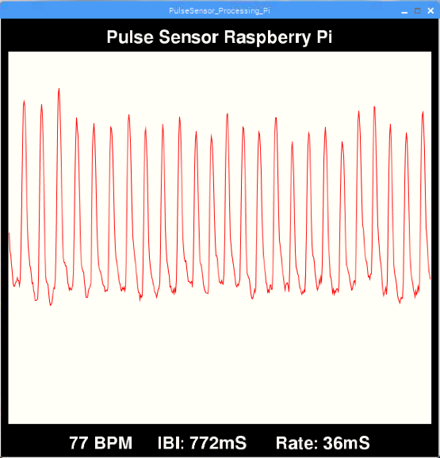

# Pulse Sensor + Processing + Raspberry Pi
The example code here is written in Processing to run on Raspberry Pi. We are using the Processing [Hardware I/O](https://processing.org/reference/libraries/io/index.html) library to interface with the SPI pins on RasPi to visualize your pulse and BPM and blink an LED to your heartbeat!

## Things you'll need

* Pulse Sensor
* Raspberry Pi (we use a RasPi 3 B)
* Breadboard
* MCP3008 ADC IC
* LED & Resistor (220ohm - 1K)
* Jumper wires (male/female)

There are many was to set up your Pi. We used [Adafruit's](https://learn.adafruit.com/series/learn-raspberry-pi) tutorial to get set up. Once you have the Pi OS up and running, you will want to make sure that your configuration settings allow us to connect to the hardware SPI bus. In the GUI, select `Raspberry Pi Configuration`, then open the `Interfaces` tab and enable SPI.

To do this on the command line, you need to edit your config file. Open a terminal window and type in

	sudo raspi-config
	
This will open up a configuration panel. Use the arrow keys to move down to `Interfacing Options` then press the right arrow to highlight `<Select>` and press either the space bar or Enter/Return. 

In the next pane, arrow down to the SPI option and enable it.

Pi may ask you to reboot, so go ahead and do that, otherwise arrow your way to `<Finish>` and get out of the config menu.

## Connect your Pulse Sensor to Raspberry Pi
The Pulse Sensor outputs an analog signal, which the RasPi cannot natively handle. In the examples below, we are using an Analog to Digital Converter (ADC) IC to digitize the Pulse Sensor signal. As of this writing, the code below supports the MCP3008 ADC IC. (You could use the MCP3004 if you like). The Wiring Pi library has functions that enable us to easily access data from the MCP3008. You can pick one up at [Mouser](https://www.mouser.com/ProductDetail/Microchip-Technology/MCP3008-I-SL?qs=BYQkrObauiuZK6Atf%2FfReA%3D%3D&gclid=CjwKCAjwhbHlBRAMEiwAoDA343G0yGlECsWZ5zo-5UbrMk58sLaK11XtHWNU8w9fzKlpIiY343y0YBoCrBgQAvD_BwE) or [SparkFun](https://www.sparkfun.com/products/15099) or [Adafruit](https://www.adafruit.com/product/856). 

The RasPi interfaces the MCP3008 via the hardware SPI pins. Here's a diagram to help you assemble the circuit.

In addition to the MCP3008, you will need a [breadboard](https://www.adafruit.com/product/64) and some [male/female jumper cables](https://www.adafruit.com/product/826). We want to blink an LED, so you should have one of those handy, along with a resistor (220ohm to 1K should work fine).

## Pulse Sensor Sample Timing
In order to get accurate BPM data from the Pulse Sensor, it is important to have fast and regular reading of the Pulse Sensor analog signal. By fast, we mean 500Hz (1 sample every 2 milliseconds). By regular, we mean 1 sample every 2 milliseconds. Period. Not 2.5 milliseconds, not 1.8 milliseconds, not whenever the OS decides to get around to it. This is much easier to do on a microcontroller where you are not running on top of an operating system. Arduino, for example, has no problem setting its hardware timer to sample data every 2 milliseconds on the dot. But we're not in Arduino, we're in RasPi, and things are different. Since we're using Processing, we have to rely on the frame rate to time our samples in the draw() loop. Depending on whatever else your RasPi is doing, and how much work Processing is doing, your sample rate may vary a great deal. Our example sketch will give you feedback on sample timing rate and accuracy.

## Set Up Processing
If you don't already have Processing on your RasPi, you can download it from [Processing](https://pi.processing.org/download/). That link will take you to the page that tells you all about installing Processing on your Pi.

Processing keeps your code in a sketch folder. Normally this folder is

	/home/pi/Documents/Processing
	
After you download this repository, move the folder called `PulseSensor_Processing_Pi' and all of its contents into the Processing sketch folder. Then open Processing and go to

	File > Sketchbook...
	

When you run the sketch, you will see a window much like this one

The red wave plot is the raw data from your Pulse Sensor. At the bottom, there is some pulse data and process data. The **BPM** value is calculated every time Processing finds a beat. The **IBI** value is also updated every time there is a beat. **IBI** stands for Interbeat Interval, and it is the amount of time between each heartbeat. The **Rate** is the time between each sample. Since Processing can only sample each time it goes through the draw() loop, this is based on the `frameRate` variable provided by Processing. This should give you some indication as to how accurate your BPM values are.

### Other features of the sketch: 	

Press 's' or 'S' to take a screenshot of the program window. It will save in the sketch folder with the name PulseSensor<timestamp>.jpg

Press 'r' or 'R' to reset the pulse wave trace